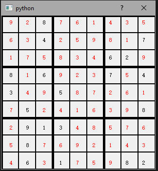

## CS5800 Final Project Knuth's Algorithm X
Implement Knuth's Algorithm X to solve Sudoku as an exact cover problem and visualize the output by PyQt5.


### Input

Import a CSV file by clicking the GUI button, the file should be a 9 x 9 valid Sudoku board with integers from 0 - 9. 0 represents the spots that need to be filled by the program. A demo CSV input is [here](demo.csv).

### Output
A 9 x 9 filled Sudoku board with black and red numbers. Black numbers are from the input. Red numbers are solved by the program.

### Demo


### How To Run
``` python
    pip install PyQt5
    
    python main.py
```
